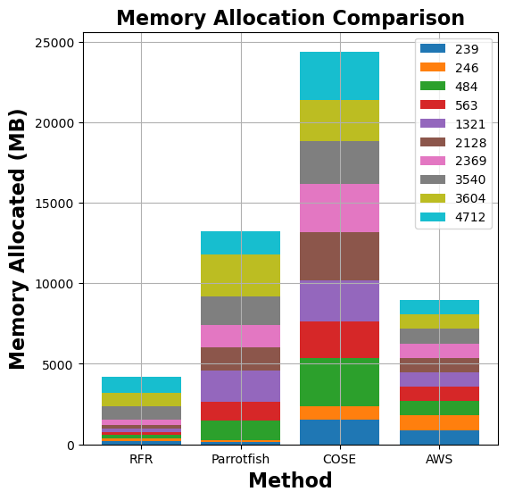

# MemFigLess
__MemFigLess__: Input-Based Ensemble-Learning Method for Dynamic *Mem*ory Con*fig*uration of Server*less* Computing Functions

## Abstract

In today's Function-as-a-Service offerings, a programmer is usually responsible for configuring function memory for its successful execution, which allocates proportional function resources such as CPU and network. However, right-sizing the function memory force developers to speculate performance and make ad-hoc configuration decisions. Recent research has highlighted that a function's input characteristics, such as input size, type and number of inputs, significantly impact its resource demand, run-time performance and costs with fluctuating workloads. This correlation further makes memory configuration a non-trivial task. On that account, an _input-aware_ function memory allocator not only improves developer productivity by completely hiding resource-related decisions but also drives an opportunity to reduce resource wastage and offer a finer-grained cost-optimized pricing scheme. Therefore, we present __MemFigLess__, a serverless solution that estimates the memory requirement of a serverless function with input-awareness. The framework executes function profiling in an offline stage and trains a multi-output _Random Forest Regression_ model on the collected metrics to invoke input-aware optimal configurations. We evaluate our work with the state-of-the-art approaches on __AWS Lambda__ service to find that MemFigLess is able to capture the input-aware resource relationships and allocate up to $82$\% less resources and save up to $87$\% run-time costs.


## Motivation

- __Insight 1__: There is a __strong__ correlation between the function payload and execution time that varies in proportion to distinct memory allocations.

<div align="center">
  
  
  
  <p><em>Figure 1: Payload vs Duration metrics for matmul (left), linpack (middle), and graph-mst (right) functions</em></p>
</div>


- __Insight 2__: There is a __positive__ correlation between the payload and minimum memory utilized for successful execution of the function, which has a direct and complex relationship with resource wastage and run-time cost.

<div align="center">
  
  
  
  <p><em>Figure 2: Payload vs Memory Utilisation metrics for matmul (left), linpack (middle), and graph-mst (right) functions</em></p>
</div>


## Multi-Output Random Forest Regression

To accurately select the memory configuration of serverless functions, a _Random Forest_ (RF)-based regression algorithm can be employed. The Random Forest is one of the most popular supervised machine learning (ML) algorithms and has been successfully applied to both classification and regression in many different tasks, such as virtual machine (VM) resource estimation, VM resource auto-scaling, and computer vision applications. This method has been demonstrated to have the ability to accurately approximate the variables with nonlinear relationships and also have high robustness performance against outliers. In addition, compared to other ML techniques, e.g., Artificial Neural Networks (ANN), Support Vector Machine (SVM), Deep Learning and Reinforcement Learning, it only needs a few tunable parameters and therefore requires low effort for offline model tuning. Furthermore, the algorithm can handle noisy or incomplete input data, and reduces the risk of overfitting which might occur with other ML algorithms. 

###  System Architecture

The model of the proposed framework is a __MAPE__ control loop, i.e., _Monitor_, _Analyse_, _Plan_ and _Execute_. In the online stage, a periodic monitoring of function performance metrics is done. It is then analysed by the resource manager via a feedback loop to plan and execute the resource allocations that meet the performance SLOs.


(For best resolution, kindly use GitHub's `White Theme`)
<div align="center">
  
  <p><em>Figure 3: MemFigLess Offline Architecture - Training and Model Development Phase</em></p>
  
  <p><em>Figure 4: MemFigLess Online Architecture - Runtime Resource Management Phase</em></p>
</div>


1. The __offline module__ is responsible for profiling the functions and training the _Random Forest Regressor_ (RFR) model, Fig. 3. Functions are executed with a variety of inputs to collect data on their performance and resource usage. Metrics such as input size, number of inputs, memory consumption, execution time and billed execution unit are recorded. The collected metrics are stored in a structured format to serve as training data for the model. A tree-based ensemble learning RFR model is trained on the collected data to learn the relationship between the function's input/payload and its memory requirement and execution time. The model captures the impact of input size distribution on resource usage and is used for online payload-aware memory estimation.

2. The __online prediction and optimisation module__ leverages the trained RFR model to select the optimal function memory based on the model prediction and constraint optimisation, and invoke functions in real-time, as shown in Fig. 4. Incoming function requests are analyzed to extract payloads which are fed to the trained RFR model to predict the execution time at distinct function memory configurations. The selected memory configurations, based on SLO constraints, are used for online constraint optimisation, either cost or execution time, provided by the user. This helps in reducing the potential resource wastage and overall cost of execution.

    -   The __dynamic resource manager__ component is embedded in the online prediction module to handle the invocation and allocation of resources based on the predictions made by the RFR model. The resource manager dynamically allocates function resources or selects the available function instance based on the constraint-optimised memory selection, ensuring minimal wastage and optimal performance. A continuous monitoring and feedback mechanism is also incorporated to improve the accuracy and performance of the system over time. This module can monitor and log the performance of functions during execution within a configured _monitoring_window_ to ensure that the model captures performance fluctuations periodically. The gathered performance data is leveraged by the training module to periodically re-train and improve the RFR model predictions.


### System Setup

We setup our proposed solution using _AWS Serverless Suite_, such as AWS Lambda, AWS DynamoDB, AWS Step Functions Workflow and Amazon Simple Storage Service (S3) for an end-to-end serverless function configuration solution. The framework can be assumed a CSP service where users can subscribe to it for an end-to-end optimisation, based on the desired deadline and run-time cost of the individual function. The offline step is implemented as a Step Functions Workflow that takes function details such as resource name, memory configurations to explore, number of profiling iterations and the representative payload(s) as a `json` input file. This information is used to create and execute a function with different payloads at distinct configurations, and collect the performance data using AWS CloudWatch . However, the payload for different functions may be of different types and thus, the workflow utilises the AWS S3 service to fetch any stored representative payload. The individual workflow tasks of creating, executing and updating the function in addition to log collection and processing, are implemented as AWS Lambda functions. All the functions are configured with a `15 minutes` timeout, `3008 MB` (maximum free tier) memory configuration, and `512 MB` ephemeral storage, to avoid any run-time resource scarcity. The processed logs are stored in AWS DynamoDB, a persistent key-value datastore. These logs are utilised by RFR training function and the trained model is placed in S3 storage for online estimation.

The online step makes use of the trained RFR model which is also implemented as a function, assuming shorter executing functions. The RFR model is implemented using `Scikit-Learn`, a popular ML module in Python. This function loads the RFR model for inference, estimates resources, performs the optimisation and invokes the selected function configuration. In addition, performance monitoring can be scheduled to collect and store the logs in the key-value datastore and a _monitoring window_ can be setup for periodic log processing and model re-training.

## Performance Evaluation

We perform our experimental analysis on a range of functions implemented in `Python v3.12`, taken from serverless benchmarks [FuncitonBench](https://github.com/ddps-lab/serverless-faas-workbench) and [SebsBenchmark](https://github.com/spcl/serverless-benchmarks), including CPU/memory intensive (_matmul_, _linpack_, _pyaes_), scientific functions (_graph-mst_, _graph-bfs_, _graph-pagerank_) and dynamic website generation (_chameleon_, _dynamic-html_). The experimental payload values range between `[10, 10000]` with a _step size_ of `200`, for individual variables. This _step size_ was randomly chosen for the experiments and must be provided by the user for the granularity of experiments and model generation.

The following figure shows the results of our RFR model's execution time estimates across different functions:

<div align="center">
  
  
  
  
  <br>
  
  
  
  
  <p><em>Figure 5: RFR execution time estimates for linpack, pagerank, graph-bfs, graph-mst, chameleon, dynamic-html, pyaes, and matmul functions</em></p>
</div>

The following figure shows the results of our RFR model's memory utilisation estimates across different functions:

<div align="center">
  
  
  
  
  <p><em>Figure 6: RFR memory utilization estimates for linpack, pagerank, matmul, and graph-bfs functions</em></p>
</div>


To evaluate our model's efficiency in reducing excess resource allocation and higher run-time costs, we compare our work with [COSE](https://github.com/akhtarnabeel/COSE-Serverless-Configuration), [Parrotfish](https://github.com/ubc-cirrus-lab/parrotfish) and [AWS Lambda Power Tuning Tool](https://github.com/alexcasalboni/aws-lambda-power-tuning). 
The following figures show the comparison of memory allocation and run-time costs between MemFigLess and competing approaches (COSE, Parrotfish, and AWS Lambda Power Tuning) for different functions:

<div align="center">
  
  
  
  
  <br>
  
  
  
  
  <p><em>Figure 7: Comparison of memory allocation and run-time costs for graph-mst, pyaes, graph-bfs, and matmul functions between MemFigLess and competing approaches (COSE, Parrotfish, and AWS Lambda Power Tuning)</em></p>
</div>


In terms of memory allocation, MemFigLess allocates `54%`, `75%` and `65%` less cumulative memory as compared to Parrotfish, COSE and AWS Power Tuning for _graph-mst_. Additionally, this allocation allows to save `57%`, `79%`and `58%` in cumulative run-time costs of _graph-mst_ against when run with Parrotfish and COSE selected configuration. The gains are more visible for _pyaes_ function, where MemFigLess is able to save `82%` additional resources as compared to COSE leading to `84%` cost benefits. Similar results are achieved for _graph-bfs_ where MemFigLess saved `65%` and `75%` resources as compared to Parrotfish and AWS Power Tuning, and was `87%` cost efficient in comparison to COSE. For _matmul_ function, the resource savings are approximately `73%` as compared to COSE and Parrotfish. 


### Conclusions

In this work, we present MemFigLess, a _Random Forest regression-based payload-aware_ solution to optimise function memory configuration. This solution is implemented using _AWS serverless services_ and deployed as a workflow. A motivation study is conducted to highlight the importance of payload-aware resource configuration for performance guarantees. We identify a strong and positive correlation between function payload, execution time and memory configuration to formalise the resource configuration as a multi-objective optimisation problem. A concept of _Pareto dominance_ is utilised to perform online resource optimisation. We compare the proposed solution to [COSE](https://github.com/akhtarnabeel/COSE-Serverless-Configuration) and [Parrotfish](https://github.com/ubc-cirrus-lab/parrotfish) and demonstrate the effectiveness of RFR in reducing resource wastage and saving costs. MemFigLess is able to reduce excess memory allocation of as high as `85%` against COSE and save run-time cost of up to `71%` contrasting to Parrotfish.


## References

To cite this repository in your works, please use the following entry:

```
@inproceedings{Memfigless,
author = {Agarwal, Siddharth and Rodriguez, Maria A. and Buyya, Rajkumar},
title = {Input-Based Ensemble-Learning Method for Dynamic Memory Configuration of Serverless Computing Functions},
year = {2024},
publisher = {IEEE CS Press},
address = {USA},
booktitle = {Proceedings of the Seventeenth International Conference on Utility and Cloud Computing},
pages = {346–355},
numpages = {10},
keywords = {Serverless Computing, Function-as-a-Service,
function configuration, input-awareness, constraint optimisation},
location = {Sharjah, UAE},
series = {UCC '24}
}
```