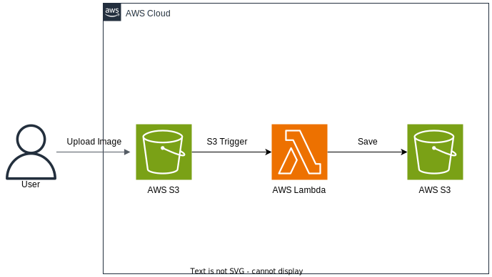
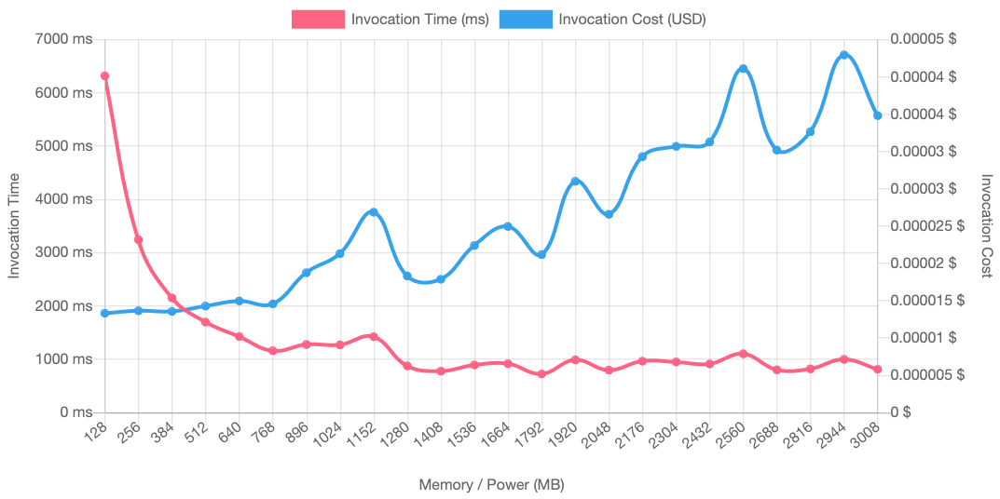

### Image Resizer Function Workflow  
1. Upload picture to an _AWS S3 Bucket_ 
2. invokes a _AWS Lambda_ function to resize 
3. Download the resized picture to a different bucket
(Instruction available [here](https://docs.aws.amazon.com/lambda/latest/dg/with-s3-tutorial.html))
4. __Note:__ the `/tmp` should be cleared before subsequent lambda invocations to avoid 
accumulation of files in memory</s>

__NOTE:__  
- PowerTools for AWS Lambda (Python) for distributed tracing, structured logging, metrics and event routing 

#### Architecture Diagram

#### AWS Lambda Power Tuning Tool Result

__Note:__  
 - this analysis was done on [AWS Lambda Power Tuning tool](https://serverlessrepo.aws.amazon.com/applications/arn:aws:serverlessrepo:us-east-1:451282441545:applications~aws-lambda-power-tuning) and the results were generated using payload in AWS S3 bucket `image-resizer-upload`, particularly `image3.jpg`, `image4.jpg`, `image5.jpg` and `image6.jpg` 
 - the generated results are also available at [link](https://lambda-power-tuning.show/#gAAAAYABAAKAAgADgAMABIAEAAWABQAGgAYAB4AHAAiACAAJgAkACoAKAAuAC8AL;q07FRVVVSkVVFQZFq7rTRKtqsUSrCpBEABCfRAAwnkSrSrFEAIBZRFXVQESril1Eq8pjRKuqM0SrqnVEAIBFRFX1b0SrqmtEq8piRKsaiUSrKkdEAIBLRFX1d0SraklE;sHReN9YpZDcZ02I3q7tuN/YlejdtvHM3FPqcN2ZqsjeU+eA3h0KZN4GYlTdqgbs3MNvQN8xSsTfh3wE4zqreN0i/Dzj1gRU4z/QXOJU/QTiOaxM4/rsdONb2SDhD1SY4) (might/might not be active)
