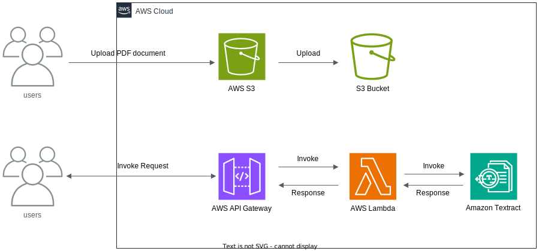
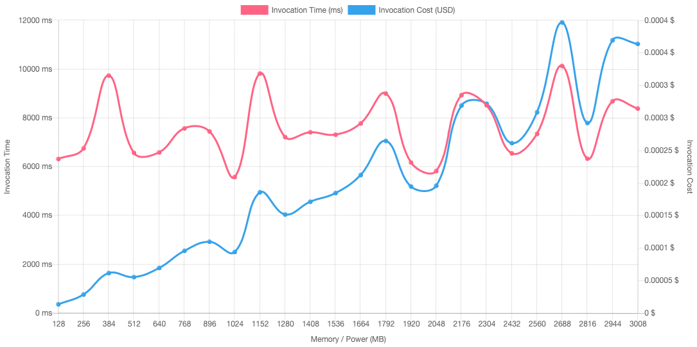

### Text Analyser Function  
1. upload a __single page__ document (pdf, jpeg, tiff or png) to AWS S3 bucket
2. invoke function to process and return _Blocks_ as response (Instructions available [here](https://docs.aws.amazon.com/textract/latest/dg/lambda.html) & [GitRepo](https://github.com/aws-samples/amazon-textract-code-samples/tree/master))

#### Architecture Diagram

#### AWS Lambda Power Tuning Tool Result

__Note:__  
 - this analysis was done on [AWS Lambda Power Tuning tool](https://serverlessrepo.aws.amazon.com/applications/arn:aws:serverlessrepo:us-east-1:451282441545:applications~aws-lambda-power-tuning) and the results were generated using payload in AWS S3 bucket `text-analyser-lambda/upload`
 - the generated results are also available at [link](https://lambda-power-tuning.show/#gAAAAYABAAKAAgADgAMABIAEAAWABQAGgAYAB4AHAAiACAAJgAkACoAKAAuAC8AL;qzrFRava0kUAAhhGq/LMRaumzUWrduxFVYXoRQAcrkUAVhlGAEThRVVp50UAZORFAMzyRVWLDEYAxMBFANS1RVWHC0ZV7QRGAHDMRVWB5UUAMh5GAJDFRVWnB0ZV8QJG;p2JeNx+/7TdFioA4cxZnOAzqkDiH88c4ZGTlOEVQxDilfkI5Lb4eOZBjMzlFIkE5zGxeOUimijlRw0s5EgRNOb8kpzm+nKg5StqIOdS8oTnlGeo51SGZOfHa2znF2Ng5) (might/might not be active)

----

### ToDo List
- [x] upload directly to S3 and invoke form request generator
- [x] list contents and invoke lambda
- [x] reduce network bandwidth and reduce data movement during experimentation