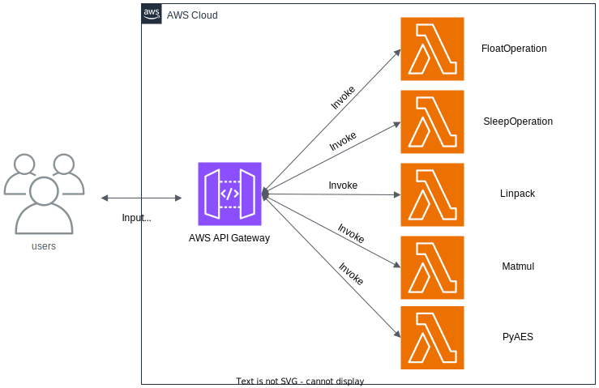
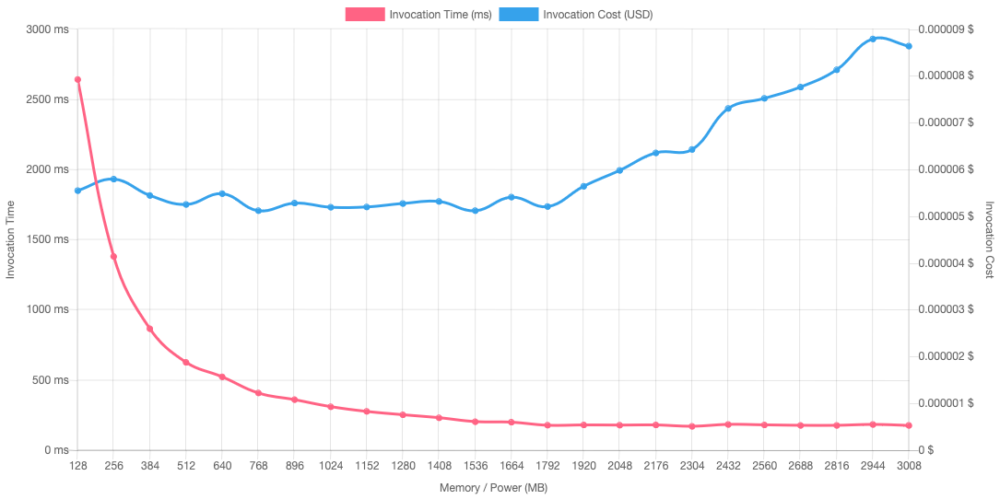
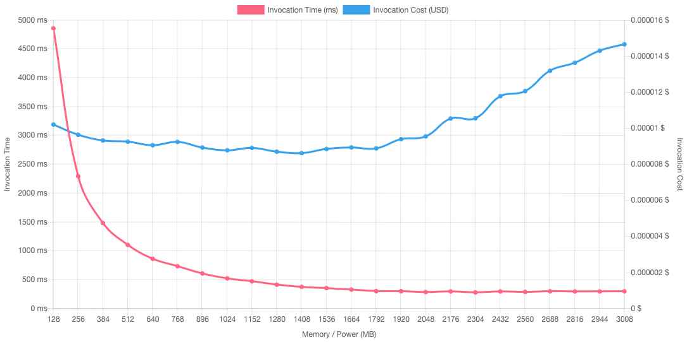

### Float Operation Function  
1. send input _payload_ with request body
2. invoke _function_ to calculate and return 
(Function available at [GitRepo](https://github.com/spcl/serverless-benchmarks/tree/master/benchmarks))

__NOTE:__  
- PowerTools for AWS Lambda (Python) for distributed tracing, structured logging, metrics and event routing  
- AWS Lambda Typing layer for events, context and response type hints 

#### Architecture Diagram

#### AWS Lambda Power Tuning Tool Result  
- __Note:__ `num=10`

- __Note:__ `num=14`

__Note:__  
 - this analysis was done on [AWS Lambda Power Tuning tool](https://serverlessrepo.aws.amazon.com/applications/arn:aws:serverlessrepo:us-east-1:451282441545:applications~aws-lambda-power-tuning) and the results were generated using payload - 1, 10, 100, 1000, 10000, 100000, 1000000
 - the generated results are also available at [link](https://lambda-power-tuning.show/#gAAAAYABAAKAAgADgAMABIAEAAWABQAGgAYAB4AHAAiACAAJgAkACoAKAAuAC8AL;VQ0lRQBgrEQA4FdEVTUcRKtKAkQAAMtDAECzQ6tqmkNVVYlDAAB7Q6uqZUOrKkpDVdVFQ6sqMENVVTJDAIAxQwAAMkOrKilDVVU2QwAAM0Orqi9DAIAvQ1XVNUNV1S5D;oxi6Ni9Xwja7pLY2KCmwNm7ptzarpqs2qROxNhIwrjYvZq42jN2wNlNGsjarpqs2CGC1Nk2crjZZMr02rq7INpk51Tbrntc2IAH1NiFD/DbRNwI3PWsIN1d7Ezdp5BA3) (might/might not be active)