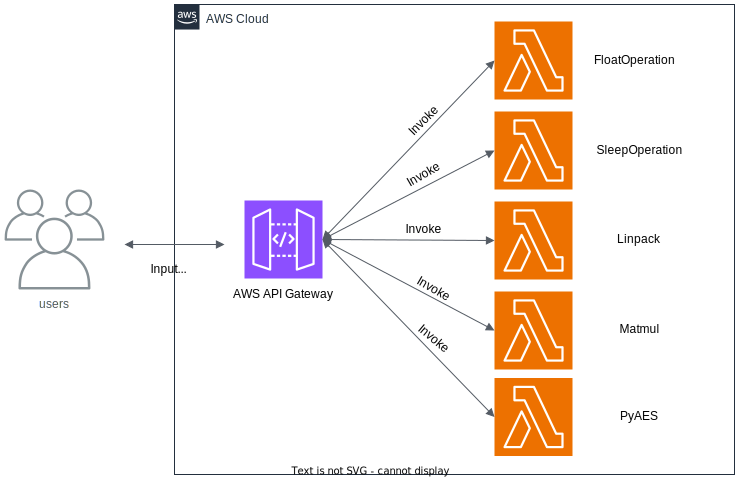

### Sleep Operation Function  
1. send input _payload_ with request body
2. invoke _function_ to sleep and return 
(Function available at [GitRepo](https://github.com/spcl/serverless-benchmarks/tree/master/benchmarks))

__NOTE:__  
- PowerTools for AWS Lambda (Python) for distributed tracing, structured logging, metrics and event routing 

#### Architecture Diagram

#### AWS Lambda Power Tuning Tool Result

__Note:__  
 - this analysis was done on [AWS Lambda Power Tuning tool](https://serverlessrepo.aws.amazon.com/applications/arn:aws:serverlessrepo:us-east-1:451282441545:applications~aws-lambda-power-tuning) and the results were generated using payload - 1, 5, 10, 20, 25, 30
 - the generated results are also available at [link](https://lambda-power-tuning.show/#gAAAAYABAAKAAgADgAMABIAEAAWABQAGgAYAB4AHAAiACAAJgAkACoAKAAuAC8AL;AAW9RlUFvUarBb1GVQW9RgAAvUYABb1GAAW9RlUFvUZVAL1GqwW9RgAFvUYAAL1GVQC9RlUFvUYABb1GAAW9RgD9vEarBL1GAAW9RgAFvUar/7xGAAW9RqsFvUYABr1G;SRxVOEkc1Tg31R85SRxVOXMthTk31Z85wHi6OUkc1Tm/uu85rjEFOnKDEjok0B86USMtOsB4OjqEykc6SRxVOnhkYjrSv286lxF9Oq4xhTof1os6coOSOlQsmTrGgJw6) (might/might not be active)